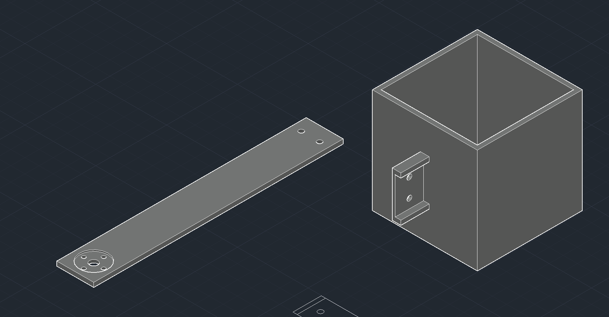
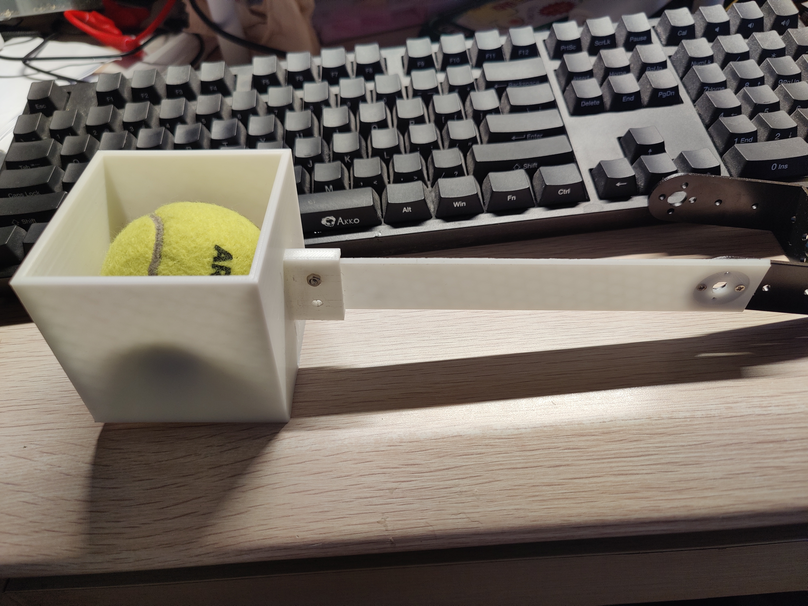

## Machine_Arm

### 测速用代码（arduino）：

```c
/* This example Arduino Sketch controls the complete rotation of
 *  SG995 Servo motor by using its PWM and Pulse width modulation technique
 */

#include <Servo.h> // include servo library to use its related functions
#define Servo_PWM 6 // A descriptive name for D6 pin of Arduino to provide PWM signal
Servo MG995_Servo;  // Define an instance of of Servo with the name of "MG995_Servo"
  

void setup() {
  MG995_Servo.attach(Servo_PWM);  // Connect D6 of Arduino with PWM signal pin of servo motor

}

void loop() {
  MG995_Servo.write(0); //Turn clockwise at high speed
  delay(5000);
  // MG995_Servo.detach();//Stop. You can use deatch function or use write(x), as x is the middle of 0-180 which is 90, but some lack of precision may change this value
  // delay(2000);
  // MG995_Servo.attach(Servo_PWM);//Always use attach function after detach to re-connect your servo with the board
  MG995_Servo.write(180);
  delay(5000);
  // MG995_Servo.detach();//Stop
  // delay(2000);
  // MG995_Servo.attach(Servo_PWM);

      
}
```


### 大致流程

当小车到达垃圾桶前面时，主控（stm32）通过 pwm 信号使能机械臂，让其从初始位置旋转 180 度，将球竖直向下投入口正下方的框里。在小车上的舵机和机械臂将会有平台垫高以保证舵机和机械臂的高度高于框，因此球一定能落入框内

选择这个结构的原因：

1. 简单，只需单舵机就可完成

2. 轻且占用空间较小。plc 材料不是特别重，并且相较于桥型的结果。该设计占用空间较小

3. 自定义。3d 建模可以保证我们能定制传动杆的长度，厚度，以及接口种类。并且可以对不同的物品进行定制，比如该任务的网球。通过建模可以使其无阻尼地滑入框并且不容易卡住和落出

   

### 机械设计 v1:


舵机——机械臂链接件

通过舵机圆盘，用螺丝链接


机械臂传动杆，左边为机械臂圆盘，3d 打印时组合；右边连接撞球框，且为通过螺丝螺母连接


球筐与连接件，以网球尺寸前后分别冗余 3mm，避免卡住和保证无阻尼


### 整体效果




#### 实体：




#### 第一版实现情况：

优点：

​	螺丝打孔无问题，连接稳固

​	网球实现无摩擦，不会卡住

​	总体重量较轻，无负担


缺点：

​	传动杆硬度不足，不过影响不大


解决方案：

​	重新设计球筐

​	传动杆填充增加


**TODO**

- [x] 待部件到了连接舵机实现测试
- [x] 第二版 3D 打印
- [ ] 等待实机搭建，固定垫高平台