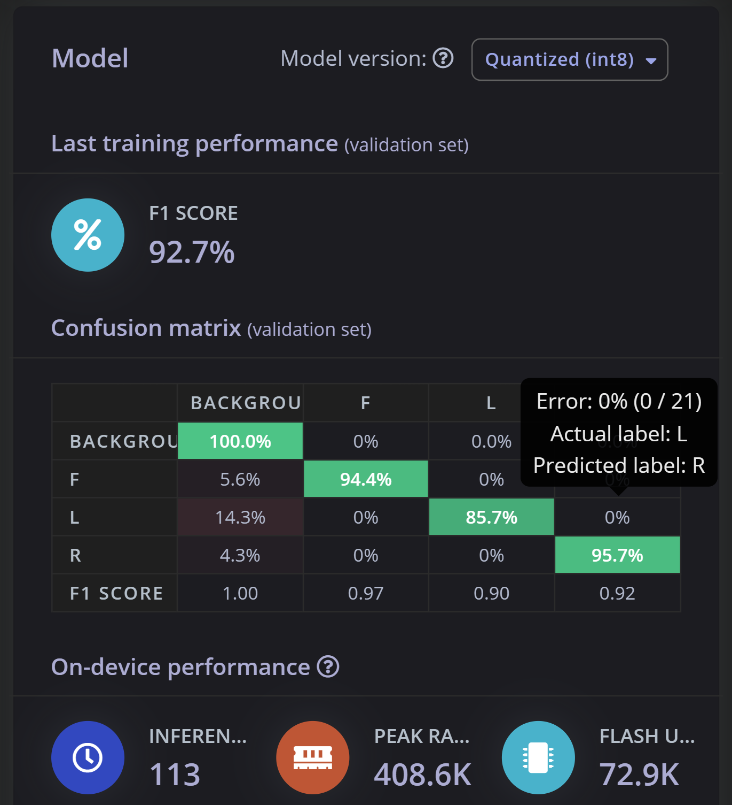

[TOC]

# openmv 路面巡线

用于巡线路面为稀碎石子路面，周围路面为平整石板路面。

根据用于巡线路面和巡线路面周围路面纹理不同来判断当前小车前进的方向。

## 边缘检测

```
img.find_edges(image.EDGE_CANNY, threshold=(60, 80))
```

通过canny算子对路面进行边缘检测，得到的结果为巡线路面边缘密集复杂，正常路面边缘稀疏。这一步需要检测到尽量多的边缘，因此使用较大的分辨率。


## 滤波

```
img.mean(5)
```

使用mean，以盒式滤波器的标准均值模糊滤波。5的意义是内核大小是7x7。得到的结果是画面模糊，周围路面上的一些边缘被模糊到几乎难以看清，而巡线路面边缘众多，模糊后更加像一个整体。


```
img = img.mean_pool(10,10)
```

使用均值池化，每10x10大小像素均值为一个像素，降低下一步计算开销。


## 自适应二值化图像

```
    img_statistics = img.get_statistics()
    max_value = img_statistics.max()
    uq_value = img_statistics.uq()
    img = img.binary([(uq_value,max_value)],invert=False)
```

img.get_statistics()计算图像中每个颜色通道的平均值、中值、众值、标准偏差、最小值、最大值、下四分值和上四分值，并返回一个数据对象statistics

获取最大值

获取上四分值

二值化图像，

[(uq_value,max_value)]是一个元组列表，对于灰度图像，每个元组需要包含两个值 - 最小灰度值和最大灰度值。 仅考虑落在这些阈值之间的像素区域。在这里只考虑最亮的一部分的像素，这实际上是一个高通滤波，只留下边缘丰富的检测路面的像素。


## 划线和命令输出

```python
# 划线（霍夫变换）
    line = img.get_regression([(255,255)], robust = True)
    #(255,255):追踪的颜色范围：纯白色
    #robust = True:使用Theil-Sen线性回归算法
    if (line):#如果存在符合要求的直线
            rho_err = abs(line.rho())-img.width()/2
                #rho_err:负值直线在左侧正值在右侧若为水平线的中垂线则为0
                #line.rho():通过霍夫变换拟合出直线相对于原点的距离(像素数)(即r=xcosθ+ysinθ中的r)
                #img.width():以像素计图像的宽度
            if line.theta()>90:
                #line.theta():0-90 Y+半轴和直线的夹角,90-180 Y-半轴和直线的夹角
                theta_err = line.theta()-180
            else:
                theta_err = line.theta()
                #处理后:绝对值为直线同Y+轴的夹角,右正左负
            img.draw_line(line.line(), color = 127)
            # print(rho_err,line.rho(),line.magnitude(),line.theta(),theta_err)
            # line.magnitude():霍夫变换后所得直线的模

            # w：角度的，左偏为正，右偏为负,
            # print(str(line.theta()))
            if line.theta() >= 90:
                w = line.theta()-90 -90
            else:
                w = line.theta()+90 -90

            if w>=0:
                if -10<w<10:
                    command = "151000"+str(abs(w))
                else:
                    command = "15100"+str(abs(w))
            else:
                if -10<w<10:
                    command = "151010"+str(abs(w))
                else:
                    command = "15101"+str(abs(w))

            # 05 00 013: 0代表负\左，1代表正\右，第一位是符号位，发送三个数：x,y,w
            uart.write(command)
            print("command: "+command)
```

具体已经在注释里写了


输出结果


## 其他图片


## 完整代码

```python
import sensor, image, time
from pyb import UART,Timer
import micropython

# 串口
uart = UART(3, 115200, timeout_char = 1000)

# 初始化sensor.
sensor.reset()

sensor.set_pixformat(sensor.GRAYSCALE) # or sensor.RGB565 设置图像颜色

sensor.set_framesize(sensor.VGA) # or sensor.QVGA (or others) 设置图像像素大小

sensor.skip_frames(30) # 跳过一定帧 让新的设置生效

sensor.set_gainceiling(8) # 设置相机图像增益上限

# 跟踪FPS帧率
clock = time.clock()

# 设置使用模型
model = 0

#def a_func():
    #global command
    #uart.write(command+'xxx'+'\n')

## 定时器
#timer = Timer(4)
#timer.init(freq=2)
#timer.callback(lambda t: a_func())

#------------------------------------------------------------------------------------------#

## 模型0：巡线
def line_patrol():

    clock.tick() # 追踪两个snapshots()之间经过的毫秒数.
    img = sensor.snapshot() # 拍一张照片并返回图像。

    # 使用Canny边缘检测器 #threshold设置阈值
    img.find_edges(image.EDGE_CANNY, threshold=(60, 80))

    # 消噪
    img.mean(5)

    # 池化
    img = img.mean_pool(10,10)

    # 二值化图像   #自适应二值化
    img_statistics = img.get_statistics()
    max_value = img_statistics.max()
    uq_value = img_statistics.uq()
    #print(max_value,uq_value)

    img = img.binary([(uq_value,max_value)],invert=False)

    # 侵蚀
    #img.erode(1)

    # 扩张
    img.dilate(3)

    # 划线（霍夫变换）
    line = img.get_regression([(255,255)], robust = True)
    #(255,255):追踪的颜色范围：纯白色
    #robust = True:使用Theil-Sen线性回归算法
    if (line):#如果存在符合要求的直线
            rho_err = abs(line.rho())-img.width()/2
                #rho_err:负值直线在左侧正值在右侧若为水平线的中垂线则为0
                #line.rho():通过霍夫变换拟合出直线相对于原点的距离(像素数)(即r=xcosθ+ysinθ中的r)
                #img.width():以像素计图像的宽度
            if line.theta()>90:
                #line.theta():0-90 Y+半轴和直线的夹角,90-180 Y-半轴和直线的夹角
                theta_err = line.theta()-180
            else:
                theta_err = line.theta()
                #处理后:绝对值为直线同Y+轴的夹角,右正左负
            img.draw_line(line.line(), color = 127)
            # print(rho_err,line.rho(),line.magnitude(),line.theta(),theta_err)
            # line.magnitude():霍夫变换后所得直线的模

            # w：角度的，左偏为正，右偏为负,
            # print(str(line.theta()))
            if line.theta() >= 90:
                w = line.theta()-90 -90
            else:
                w = line.theta()+90 -90

            if w>=0:
                if -10<w<10:
                    command = "151000"+str(abs(w))
                else:
                    command = "15100"+str(abs(w))
            else:
                if -10<w<10:
                    command = "151010"+str(abs(w))
                else:
                    command = "15101"+str(abs(w))

            # 05 00 013: 0代表负\左，1代表正\右，第一位是符号位，发送三个数：x,y,w
            uart.write(command)
            print("command: "+command)

#------------------------------------------------------------------------------------------#

## 模型1：箭头检测
def identification_arrow():
    clock.tick() # 追踪两个snapshots()之间经过的毫秒数.
    img = sensor.snapshot() # 拍一张照片并返回图像。


#------------------------------------------------------------------------------------------#

## 主循环
while(True):
    if model == 0:
        line_patrol()
    if model == 1:
        identification_arrow()


    print("now fps: "+str(clock.fps())) # 注意:你的OpenMV摄像头的运行速度只有它的一半

```

# Arduino 底盘记录

```c++
  if (Serial.available() > 0)
  {
    Serial.println("####----------------------------------------------------------------------------------------------------------------------------------------------------------------------------------------------###");
    data = Serial.parseInt();
    int data43 = Serial.parseInt();//读空白符，垃圾数据，不要删
    Serial.print("data is : ");
    Serial.println(data); 

    F_linear_x = (int)floor(data / 1000000);
    linear_x = (double)floor(data / 100000 - F_linear_x * 10);
    F_linear_y = (int)floor(data / 10000 - F_linear_x * 100 - linear_x * 10);
    linear_y = (double)floor(data / 1000 - F_linear_x * 1000 - linear_x * 100 - F_linear_y * 10);
    F_linear_w = (int)floor(data / 100 - F_linear_x * 10000 - linear_x * 1000 - F_linear_y * 100 - linear_y * 10);
    linear_w = (double)floor(data / 10 - F_linear_x * 100000 - linear_x * 10000 - F_linear_y * 1000 - linear_y * 100 - F_linear_w * 10);

    if (F_linear_x == 0)
    {
      linear_x = -linear_x;
    }

    if (F_linear_y == 0)
    {
      linear_y = -linear_y;
    }

    if (F_linear_w == 0)
    {
      linear_w = -linear_w;
    }
  }
```

串口通信时，使用data = Serial.parseInt();来读取发送到串口的一串数字，但是parseInt()函数读到空白符停止，下一个循环因为串口缓冲区还有一个空白符，Serial.available()为1，会再次进入循环，这时读取空白符，data置0，数据读取就失败了。

因此读过一遍后再让他读一遍垃圾数据，就能解决问题


# 箭头识别

用于识别箭头，当识别到箭头为朝上，向前撞倒立牌；箭头为朝左，向左前方撞倒立牌；箭头为朝右，向右前方撞倒立牌。

## 问题分析与算法选择

由于立牌上的箭头图像较小，且箭头并非常规几何图形，难以通过常规算法确定其精准位置并裁剪识别方向，故我们最终选择在OpenMV上部署经过量化、裁剪后的轻量人工智能目标检测模型。

模型采用FOMO (Faster Objects, More Objects)，通过Edge Impulse在线模型训练测试平台完成。FOMO是一种早期但小巧的目标识别模型，通过将输入图片切分为8x8分辨率的小块(batch)，然后对每个小块分别进行分类并进行汇总。该网络将MobileNetV2 0.35作为迁移学习模型。

具体而言，FOMO将经典的MobileNetV2从特征提取的中间截断，得到一个大小为n x n x c (n是特征图的宽高，c 是特征图的通道数) 的特征图。例如，如果输入分辨率是128 x 128且期望特征图输出大小为8 x 8，则相当于把输入图片分辨率降低了16倍。这意味着FOMO会从MobileNetV2网络结构中找到该层进行截断，最终得到8 x 8的特征图。


在输出的大小为n x n x c的特征图中，c代表了有c个分类，每一层都用来寻找一个分类的物体的位置，每层的所有像素就代表了在该位置是否存在该分类的物体（即置信度）。如果我们遍历了这个n x n x c的特征图并找到了置信度超过设置阈值的像素坐标，我们便能认为这些坐标中存在待检测的物体，也就能按照缩放比例将其映射回原图。由于截断的特征图并不能准确反映出bounding box的角点坐标，FOMO只会输出关键特征图的几何中心，以实现简单的目标检测。

我们选择使用128x128分辨率以平衡较远距离时的目标分辨率和帧率，并将变量量化为int8类型以减少模型的内存占用。

最终，该模型在测试集中实现了92.7%的F1值(F1 value)，并达到了100%的精准率(Precision)。**（这里可以把F1值/精准率的公式加上）**其占用ROM仅为30.3Kb，运行帧率大约为10帧。

## 模型数据采集与处理

在晴天上午，于测试场地，我们使用购买的亚克力板，上贴10cm x 10cm的三种不同朝向的箭头，从距离10cm-30cm，俯仰角0-向上45度，左右间距正负10cm等不同机位，通过OpenMV相机采集了约400张分辨率为128x128的图片，以确保不同角度，不同距离的箭头图片都能得到采集。

在经过数据清洗后，得到朝上箭头图片96张，朝左箭头图片105张，朝右箭头图片106张作为训练数据集。剩下20%的图片被划分到测试集。

经过综合分析，由于OpenMV算力较弱，无法运行YOLO等对目标大小泛化性良好的人工智能模型，因此我们选择了FOMO作为机器学习的算法。

通过Edge Impulse在线平台，所有图片在被上传后进行人工标注。在这一步，由于FOMO的原理是划分成正方形小块依次分类，所以左右箭头的拖尾部分有很大概率无法被正确分类。因此我选择了

由于数据增强会导致左右箭头出现随机颠倒的情况，故没有进行。我们选择以0.001的学习率，60轮训练作为参数进行训练，获得了如下的效果：



最后，经过模型裁剪与量化，我们获得了可直接部署到OpenMV上的模型文件。

## 模型部署与调用

我们将箭头识别模型的调用进行了函数封装，使用以下代码进行模型部署：

```python
def identification_arrow():
    sensor.reset()                         # Reset and initialize the sensor.
    sensor.set_pixformat(sensor.RGB565)    # Set pixel format to RGB565
    sensor.set_framesize(sensor.B128X128)  # Set frame size to 128x128, whic is equal to model input
    sensor.set_windowing((128, 128))       # Set 128x128 window.
    sensor.skip_frames(time=2000)          # Let the camera adjust.


    net = None
    labels = None
    min_confidence = 0.7    # 需要根据实际情况设置置信度
    num_arrow = 20          # 检测到num_arrow次箭头后计算方向，20时根据识别情况，需要大约3-6s

    try:
        # load the model, alloc the model file on the heap if we have at least 64K free after loading
        net = tf.load("trained.tflite", load_to_fb=uos.stat('trained.tflite')[6] > (gc.mem_free() - (64*1024)))
    except Exception as e:
        raise Exception('Failed to load "trained.tflite", did you copy the .tflite and labels.txt file onto the mass-storage device? (' + str(e) + ')')

    try:
        labels = [line.rstrip('\n') for line in open("labels.txt")] # 包含了识别的种类和顺序
    except Exception as e:
        raise Exception('Failed to load "labels.txt", did you copy the .tflite and labels.txt file onto the mass-storage device? (' + str(e) + ')')

    colors = [ # 用3种颜色显示不同的箭头
        (255,   0,   0),
        (  0, 255,   0),
        (255, 255,   0),
        (  0,   0, 255),
    ]

    clock = time.clock() #设置计时器记录帧率
    ARROW = [] #记录识别出的不同箭头
    clock.tick() #开始计时
    while(len(ARROW) <= num_arrow): # 识别到x次箭头后退出模型

        img = sensor.snapshot()
    # detect() returns all objects found in the image (splitted out per class already)
    # we skip class index 0, as that is the background, and then draw circles of the center
    # of our objects

        for i, detection_list in enumerate(net.detect(img, thresholds=[(math.ceil(min_confidence * 255), 255)])):
            if (i == 0): continue # background class
            if (len(detection_list) == 0): continue # no detections for this class
            else:
                if (i == 1): ARROW.append(i)
                elif (i == 2): ARROW.append(i)
                elif (i == 3): ARROW.append(i)

            #print("********** %s **********" % labels[i])
            for d in detection_list:
                [x, y, w, h] = d.rect()
                center_x = math.floor(x + (w / 2))
                center_y = math.floor(y + (h / 2))
                #print('x %d\ty %d' % (center_x, center_y))
                img.draw_circle((center_x, center_y, 12), color=colors[i], thickness=2)

    print(clock.fps(), "fps", end="\n\n")

    direct = max(ARROW, key=lambda v: ARROW.count(v))
    print("direction is: ",direct)
    if(direct == 1): pass # 向前走，具体时长和方向（防止被倒下立牌困住）需要实际测试
    elif(direct == 2): pass # 向左前走
    elif(direct == 3): pass # 向右前走
```

当您需要调用该模型时，请注意以下几点：

1. 当函数被调用后，相机设置会被重新指定。因此当模型调用完成后，需要您重新指定相机参数。
2. 该函数应该在小车到达指定位置（即立牌正前方）并彻底停下后启用，可根据实际测试情况调整舵机角度为平视或45度下倾。
3. 为了避免瞬时误差，函数会将检测到的每一帧的箭头的类别添加到列表中，当列表长度达到指定数目（暂定20）后，函数通过列表的众数来确定最终的类型。

## 模型效果展示


可以看到，模型对不同角度和远近的箭头都能比较好地识别出位置并正确分类。

## 需要改进的地方

1. 回传给主控消息。（需要实地测试计算）
2. 有一定可能将暗角识别为箭头（相当于多识别了箭头），但实地场景可能不会出现此类情况。如果需要改进，可以多拍箭头占比比较大的照片重新训练。（很快，主要麻烦的是给数据打标签。。。）
3. 置信度，检测总时间等参数还能进一步调整。
4. 舵机的俯仰角感觉不用调整，但也需要测试。
5. 我这个亚克力板比较小，但场地的测试亚克力板立不起来。。。
6. 具体摆放立牌的位置不确定，当天的天气情况也不确定。准备再试试数据增强，拉一下曝光亮度对比度之类的。
