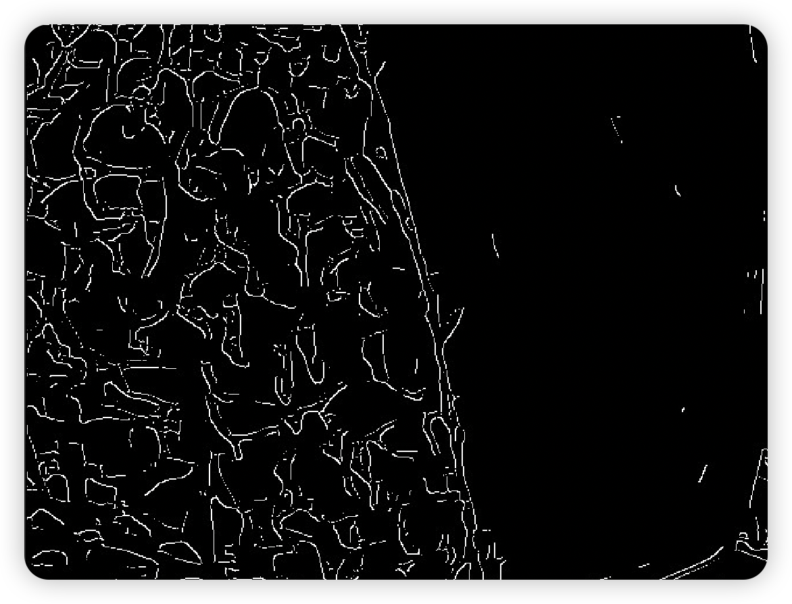
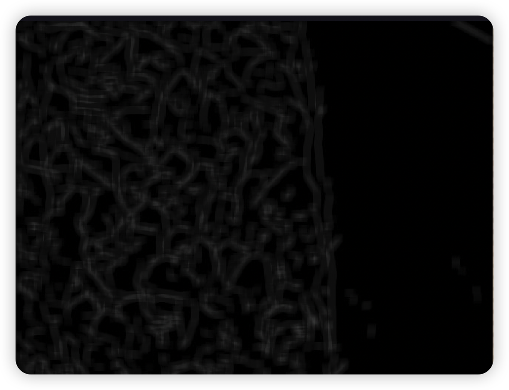
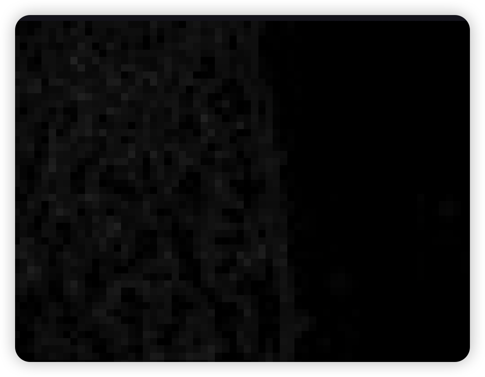
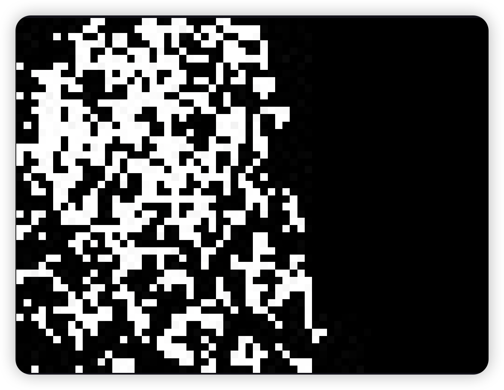
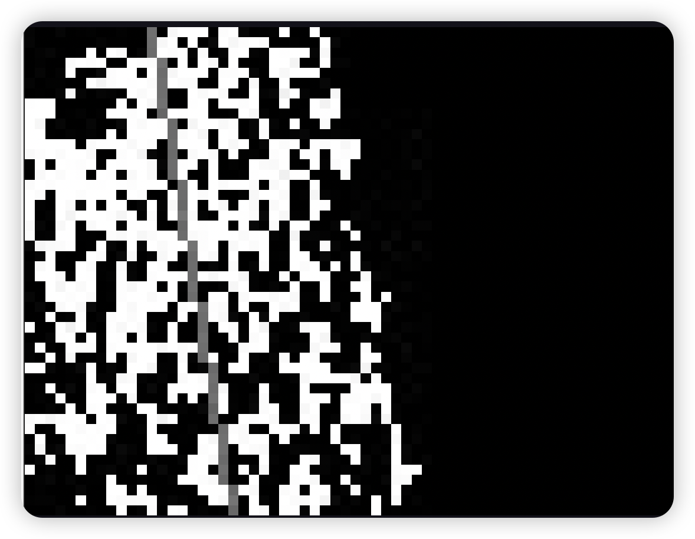
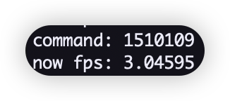
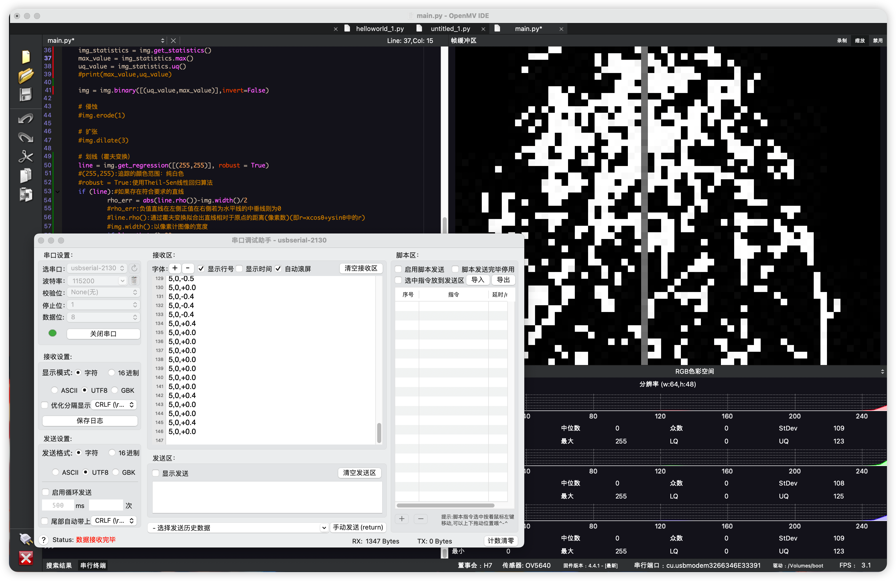
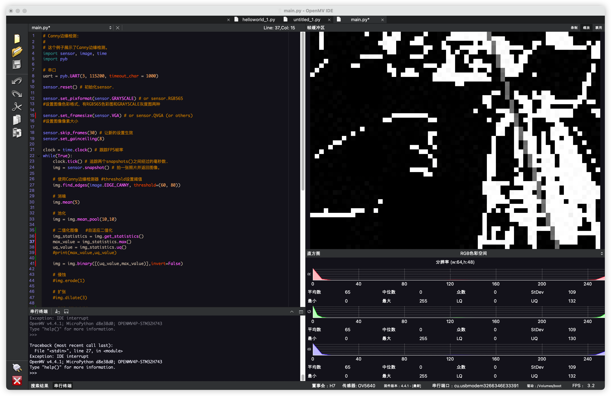

[TOC]


# openmv 路面巡线

用于巡线路面为稀碎石子路面，周围路面为平整石板路面。

根据用于巡线路面和巡线路面周围路面纹理不同来判断当前小车前进的方向。

## 边缘检测

```
img.find_edges(image.EDGE_CANNY, threshold=(60, 80))
```

通过canny算子对路面进行边缘检测，得到的结果为巡线路面边缘密集复杂，正常路面边缘稀疏。这一步需要检测到尽量多的边缘，因此使用较大的分辨率。



## 滤波

```
img.mean(5)
```

使用mean，以盒式滤波器的标准均值模糊滤波。5的意义是内核大小是7x7。得到的结果是画面模糊，周围路面上的一些边缘被模糊到几乎难以看清，而巡线路面边缘众多，模糊后更加像一个整体。



```
img = img.mean_pool(10,10)
```

使用均值池化，每10x10大小像素均值为一个像素，降低下一步计算开销。



## 自适应二值化图像

```
    img_statistics = img.get_statistics()
    max_value = img_statistics.max()
    uq_value = img_statistics.uq()
    img = img.binary([(uq_value,max_value)],invert=False)
```

img.get_statistics()计算图像中每个颜色通道的平均值、中值、众值、标准偏差、最小值、最大值、下四分值和上四分值，并返回一个数据对象statistics

获取最大值

获取上四分值

二值化图像，

[(uq_value,max_value)]是一个元组列表，对于灰度图像，每个元组需要包含两个值 - 最小灰度值和最大灰度值。 仅考虑落在这些阈值之间的像素区域。在这里只考虑最亮的一部分的像素，这实际上是一个高通滤波，只留下边缘丰富的检测路面的像素。



## 划线和命令输出

```python
# 划线（霍夫变换）
    line = img.get_regression([(255,255)], robust = True)
    #(255,255):追踪的颜色范围：纯白色
    #robust = True:使用Theil-Sen线性回归算法
    if (line):#如果存在符合要求的直线
            rho_err = abs(line.rho())-img.width()/2
                #rho_err:负值直线在左侧正值在右侧若为水平线的中垂线则为0
                #line.rho():通过霍夫变换拟合出直线相对于原点的距离(像素数)(即r=xcosθ+ysinθ中的r)
                #img.width():以像素计图像的宽度
            if line.theta()>90:
                #line.theta():0-90 Y+半轴和直线的夹角,90-180 Y-半轴和直线的夹角
                theta_err = line.theta()-180
            else:
                theta_err = line.theta()
                #处理后:绝对值为直线同Y+轴的夹角,右正左负
            img.draw_line(line.line(), color = 127)
            # print(rho_err,line.rho(),line.magnitude(),line.theta(),theta_err)
            # line.magnitude():霍夫变换后所得直线的模

            # w：角度的，左偏为正，右偏为负,
            # print(str(line.theta()))
            if line.theta() >= 90:
                w = line.theta()-90 -90
            else:
                w = line.theta()+90 -90

            if w>=0:
                if -10<w<10:
                    command = "151000"+str(abs(w))
                else:
                    command = "15100"+str(abs(w))
            else:
                if -10<w<10:
                    command = "151010"+str(abs(w))
                else:
                    command = "15101"+str(abs(w))

            # 05 00 013: 0代表负\左，1代表正\右，第一位是符号位，发送三个数：x,y,w
            uart.write(command)
            print("command: "+command)
```

具体已经在注释里写了



输出结果



## 其他图片





## 完整代码

```python
import sensor, image, time
from pyb import UART,Timer
import micropython

# 串口
uart = UART(3, 115200, timeout_char = 1000)

# 初始化sensor.
sensor.reset()

sensor.set_pixformat(sensor.GRAYSCALE) # or sensor.RGB565 设置图像颜色

sensor.set_framesize(sensor.VGA) # or sensor.QVGA (or others) 设置图像像素大小

sensor.skip_frames(30) # 跳过一定帧 让新的设置生效

sensor.set_gainceiling(8) # 设置相机图像增益上限

# 跟踪FPS帧率
clock = time.clock()

# 设置使用模型
model = 0

#def a_func():
    #global command
    #uart.write(command+'xxx'+'\n')

## 定时器
#timer = Timer(4)
#timer.init(freq=2)
#timer.callback(lambda t: a_func())

#------------------------------------------------------------------------------------------#

## 模型0：巡线
def line_patrol():

    clock.tick() # 追踪两个snapshots()之间经过的毫秒数.
    img = sensor.snapshot() # 拍一张照片并返回图像。

    # 使用Canny边缘检测器 #threshold设置阈值
    img.find_edges(image.EDGE_CANNY, threshold=(60, 80))

    # 消噪
    img.mean(5)

    # 池化
    img = img.mean_pool(10,10)

    # 二值化图像   #自适应二值化
    img_statistics = img.get_statistics()
    max_value = img_statistics.max()
    uq_value = img_statistics.uq()
    #print(max_value,uq_value)

    img = img.binary([(uq_value,max_value)],invert=False)

    # 侵蚀
    #img.erode(1)

    # 扩张
    img.dilate(3)

    # 划线（霍夫变换）
    line = img.get_regression([(255,255)], robust = True)
    #(255,255):追踪的颜色范围：纯白色
    #robust = True:使用Theil-Sen线性回归算法
    if (line):#如果存在符合要求的直线
            rho_err = abs(line.rho())-img.width()/2
                #rho_err:负值直线在左侧正值在右侧若为水平线的中垂线则为0
                #line.rho():通过霍夫变换拟合出直线相对于原点的距离(像素数)(即r=xcosθ+ysinθ中的r)
                #img.width():以像素计图像的宽度
            if line.theta()>90:
                #line.theta():0-90 Y+半轴和直线的夹角,90-180 Y-半轴和直线的夹角
                theta_err = line.theta()-180
            else:
                theta_err = line.theta()
                #处理后:绝对值为直线同Y+轴的夹角,右正左负
            img.draw_line(line.line(), color = 127)
            # print(rho_err,line.rho(),line.magnitude(),line.theta(),theta_err)
            # line.magnitude():霍夫变换后所得直线的模

            # w：角度的，左偏为正，右偏为负,
            # print(str(line.theta()))
            if line.theta() >= 90:
                w = line.theta()-90 -90
            else:
                w = line.theta()+90 -90

            if w>=0:
                if -10<w<10:
                    command = "151000"+str(abs(w))
                else:
                    command = "15100"+str(abs(w))
            else:
                if -10<w<10:
                    command = "151010"+str(abs(w))
                else:
                    command = "15101"+str(abs(w))

            # 05 00 013: 0代表负\左，1代表正\右，第一位是符号位，发送三个数：x,y,w
            uart.write(command)
            print("command: "+command)

#------------------------------------------------------------------------------------------#

## 模型1：箭头检测
def identification_arrow():
    clock.tick() # 追踪两个snapshots()之间经过的毫秒数.
    img = sensor.snapshot() # 拍一张照片并返回图像。


#------------------------------------------------------------------------------------------#

## 主循环
while(True):
    if model == 0:
        line_patrol()
    if model == 1:
        identification_arrow()


    print("now fps: "+str(clock.fps())) # 注意:你的OpenMV摄像头的运行速度只有它的一半

```

# Arduino 底盘记录

```c++
  if (Serial.available() > 0)
  {
    Serial.println("####----------------------------------------------------------------------------------------------------------------------------------------------------------------------------------------------###");
    data = Serial.parseInt();
    int data43 = Serial.parseInt();//读空白符，垃圾数据，不要删
    Serial.print("data is : ");
    Serial.println(data); 

    F_linear_x = (int)floor(data / 1000000);
    linear_x = (double)floor(data / 100000 - F_linear_x * 10);
    F_linear_y = (int)floor(data / 10000 - F_linear_x * 100 - linear_x * 10);
    linear_y = (double)floor(data / 1000 - F_linear_x * 1000 - linear_x * 100 - F_linear_y * 10);
    F_linear_w = (int)floor(data / 100 - F_linear_x * 10000 - linear_x * 1000 - F_linear_y * 100 - linear_y * 10);
    linear_w = (double)floor(data / 10 - F_linear_x * 100000 - linear_x * 10000 - F_linear_y * 1000 - linear_y * 100 - F_linear_w * 10);

    if (F_linear_x == 0)
    {
      linear_x = -linear_x;
    }

    if (F_linear_y == 0)
    {
      linear_y = -linear_y;
    }

    if (F_linear_w == 0)
    {
      linear_w = -linear_w;
    }
  }
```

串口通信时，使用data = Serial.parseInt();来读取发送到串口的一串数字，但是parseInt()函数读到空白符停止，下一个循环因为串口缓冲区还有一个空白符，Serial.available()为1，会再次进入循环，这时读取空白符，data置0，数据读取就失败了。

因此读过一遍后再让他读一遍垃圾数据，就能解决问题
